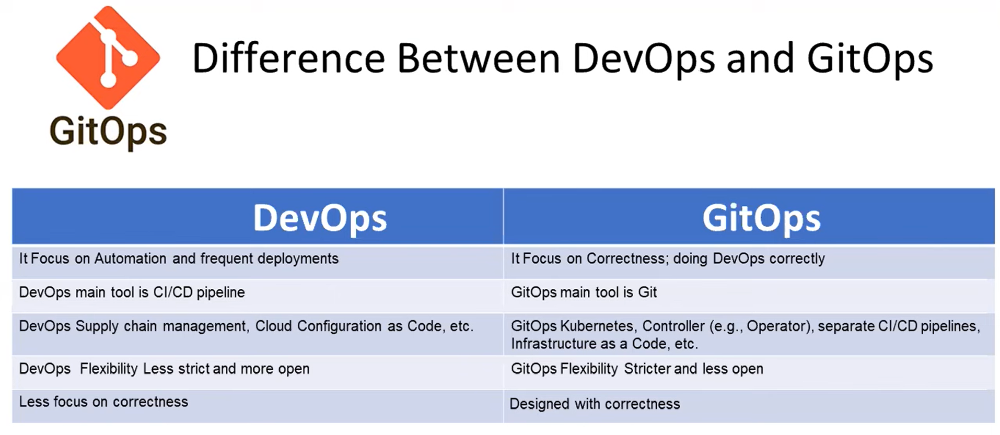
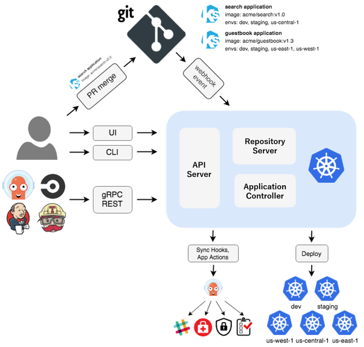
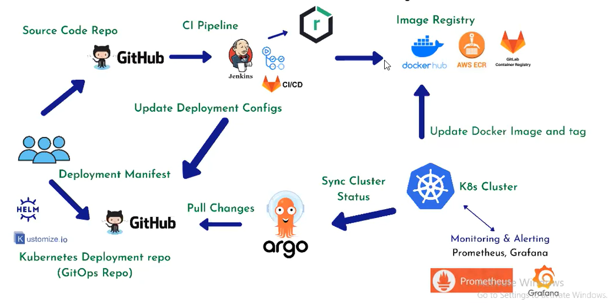

### What is GitOps?
- GitOps is a set of practices that uses Git as the single source of truth for infrastructure configuration. It automates the process of deploying and managing infrastructure by ensuring that the state of the infrastructure is always is sync with the desired state defined in Git, yeah you read it  right, in a Git repository, ehances collaboration, promotes transparency, and reduces the chances of errors.

### Benefits of GitOps?
- Scalability: GitOps can be scaled to manage large and complex infrastructure environments.
- Reliability: GitOps ensures that the infrastructure is always in a heathy state by continously verifying the actual state against the desired state
- Security: GitOps can be used to enforce security policies by defining the desired state of the infrastructure in Git.
- Collaboration: GitOps makes it easy for teams to collaborate on infrastructure management by using a single source of truth.
- Auditability: GitOps provides a complete audit trail of all changes to the infrastructure, which can be used to troubleshoot problems or comply with regulations.

### Why do we need GitOps?
- GitOps came into existence to address the challenges of managing infrastructure in a complex and dynamic environment. Traditional approaches to  infrastructure management, such as manual configuration and ad-hoc scripting, are not scalable or reliable. GitOps provides a more scalable, reliable, and secure way to manage infrastructure

### GitOps tools
- Flux
- ArgoCD
- Jenkins X
- WKSctl
- Gitkube
- Quay
- Helm Operator

### What is ArgoCD?
- This is an open-source, declarative, GitOps continous delivery tool for Kuberentes. It is designed to help developers and DevOps teams automate the deployment and management of application on Kubernetes clusters.
- ArgoCD allows you to define the desired state of your applications and their resources in a Git repository, and it continously monitors the cluster to ensure that the actual state matches the desired state.
- ArgoCD follows the principles of GitOps, where the desired state of the application is defined in a Git repository and a continous delivery system automatically synchronizes the actual state with the desired state.
- It is a powerful tool in the world of Kubernetes, to simplify the deployment and management of applications in a GitOps workflow. 
- GitOps is a paradigm that leverages version control systems like Git to manage and automate the deployment of applications on Kubernetes clusters. It's becoming popular for its ability to ensure consistency, traceability, and collaboration in the world of container orchestration.

### Key feature of ArgoCD
- GitOps Workflow: ArgoCD follows the principles of GitOps, where the desired state of application is defined in a Git repository. It continously monitors the repository for changes and ensures that the actual state of the applications matches the desired state.
- **Declarative Application Definition/Configuration**: ArgoCD follows the declarative approach, where you define your desired application state in a Git repository. This repository contains Kubernetes manifests, Helm charts or Kustomize overlays that specify how your application should run on your clusters.
- **Automated Deployment/Synchronization**: ArgoCD automates the application deployment process by continously synchronzing the desired state defination in Git with the actual state in the Kubernetes cluster. It detects changes and updates the application accordingly.
- ArgoCD continously monitors your Git repository and the actual state of your Kubernetes clusters. When it detects changes in the repository, it automatically syncs the cluster to match the desired state, ensuring your applications are allways up-to-date.
- **Rollback and Rollout**: ArgoCD provides rollback and rollout capabilities. It allows users to rollback to a previous known good state if issues occur during deployment. It also supports progressive deployments, such as canary and blure-green deployments.
- **Application Configuration Management**: ArgoCD manages application configuration using ConfigMaps, Secrets, and another Kubernetes resources. It tracks changes to the configuration and ensures that the deployed applications always use the correct configuration.
- **Multi-Environment Support/Multi-Cluster Management**: Whether you're working with a single cluster or a multi-cluster environment, ArgoCD can handle it. It simplifies the complex task of managing applications across various clusters, making it easier to maintain consistency and compliance.
- **RBAC and Security**: ArgoCD integrates with Kubernetes RBAC, providing fine-grained control over who can make changes to your applications. It helps maintain security by allowing you to define access rights and permissions.
- **Customization and Extensibility**: It is highly customizable. You can extend its functinality by creating custom plugins and hooks to fit your specific use cases, making it adaptable to your unique requirements.
- **User-Friendly WebUI**: It offers a user-friendly web-based dashboard, allowing both developers and operators to visualize the application deployment status and history, making it easier to troubleshoot and monitor deployments.
- **Integration with Git Provider**: It supports various Git hosting services, including GitHub, Gitlab and Bitbucket, making it easy to integrate in to your existing Git workflows.
- **Continous Delivery Pipelines**: It can be part of a broader continous delivery pipeline, working seamlessly with tools like Jenkins, Tekton or any CI/CD system of your choice.
- ArgoCD simplifies the complexities of managing Kubernetes application in a GitOps fashion. Whether you are kubernetes pro or just starting your journey, It's valuable addition to your toolkit for managing Kubernetes notes applications with ease and efficiency.

### ArgoCD Architecture

- API Server: The API server is a gRPC/REST server which exposes the API consumed by the Web UI, CLI, and CI/CD systems. It has the following responsibilities:
    - application management and status reporting
    - invoking of application operations (e.g. sync, rollback, user-defined actions)
    - repository and cluster credential management (stored as K8s secrets)
    - authentication and auth delegation to external identity providers
    RBAC enforcement
    - listener/forwarder for Git webhook events
- Repository Server: The repository server is an internal service which maintains a local cache of the Git repository holding the application manifests. It is responsible for generating and returning the Kubernetes manifests when provided the following inputs:

    - repository URL
    - revision (commit, tag, branch)
    - application path
    - template specific settings: parameters, helm values.yaml

- Application Controller: The application controller is a Kubernetes controller which continuously monitors running applications and compares the current, live state against the desired target state (as specified in the repo). It detects OutOfSync application state and optionally takes corrective action. It is responsible for invoking any user-defined hooks for lifecycle events (PreSync, Sync, PostSync)

### How does ArgoCD work/ArgoCD-GitOps Pipeline
